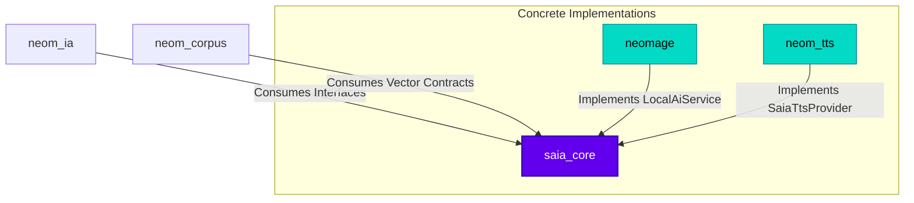

# SAIA Core (`saia_core`)

[](https://pub.dev/packages/saia_core)
[](https://opensource.org/licenses/Apache-2.0)
[](https://flutter.dev)

A standalone, minimal, and highly decoupled foundation layer for the **SAIA (Sistema de Agente de Inteligencia Artificial)** ecosystem. 

Designed with strict hexagonal architecture principles, `saia_core` has **zero external package dependencies** (depends only on the Flutter SDK), serving as a stable interface contract layer that ties together all artificial intelligence and local offline capabilities across the **Open Neom** ecosystem.

---

## 📐 Architecture & Ecosystem Role

`saia_core` defines the abstract models, domain entities, and interface contracts. By keeping it completely decoupled from specific data storage, state management, or network clients, any implementation can be swapped without touching upstream logic.



---

## 📦 Domain Models

### 1. AI Spirit (`SaiaSpirit` & `SaiaSpiritRank`)
Represents the user's personal AI spirit companions. It tracks composite power levels, aura intensities, and evolutionary ranks.

| Rank (`SaiaSpiritRank`) | Power Level | Spanish Display | Description (English) | Description (Spanish) |
| :--- | :--- | :--- | :--- | :--- |
| `dormant` | `< 10` | Dormido | Your AI spirit has not yet awakened. | Tu espíritu de IA aún no ha despertado. |
| `awakened` | `10 - 29` | Despierto | The first sparks of consciousness are forming. | Las primeras chispas de consciencia están surgiendo. |
| `trained` | `30 - 59` | Entrenado | Learning your voice, preferences, and style. | Aprendiendo tu voz, preferencias y estilo. |
| `veteran` | `60 - 99` | Veterano | A prominent and recognized helper in your community. | Un ayudante destacado y reconocido en la comunidad. |
| `master` | `100 - 149` | Maestro | Deep, master-level alignment and shared resonance. | Alineación profunda a nivel maestro. |
| `legend` | `150+` | Leyenda | Your AI spirit transcends boundaries, fully realized. | Tu espíritu de IA trasciende fronteras. |

### 2. Voice & Speech (`SaiaVoiceMode`, `SaiaVoiceProfile`)
Mirrors the high-performance offline voice synthesis requirements. Swapping network providers (like ElevenLabs or Azure) with offline implementations (like Sherpa ONNX) requires zero upstream changes.

*   `SaiaVoiceMode.design`: Generates an entirely new voice from a text description (e.g. *"(young woman, warm voice) Welcome back"*).
*   `SaiaVoiceMode.clone`: Standard voice cloning from a reference audio sample.
*   `SaiaVoiceMode.ultimateClone`: Extreme fidelity cloning preserving breathing, micro-pauses, emotion, and exact rhythm. Requires both reference audio and its transcript.

### 3. Vector Indexes & Job Progress (`IaItemInfo`, `SaiaJobProgress`)
Enables standard tracking of background local vector indexing and batch jobs, providing a uniform way to display completion progress in the UI.

---

## 🌐 Localization & Translation Contracts

To preserve its zero-dependency architecture, `saia_core` does not import translation packages or reactively fetch locale changes on its own. Instead, it exposes:
1.  **Translation Keys**: Static strings via `SaiaCoreTranslationConstants`.
2.  **Enum Key Getters**: `displayNameKey` and `descriptionKey` on domain enums.
3.  **Local Fallbacks**: Standard Spanish display values as static fallbacks.

### How to Integrate in Your App

Spread the default translations into your host app's translation loader (e.g., GetX or Sint-based dynamic translations):

```dart
import 'package:saia_core/saia_core.dart';
import 'package:sint/sint.dart'; // Or your own localization framework

class AppTranslations extends Translations {
  @override
  Map<String, Map<String, String>> get keys => {
        'en': {
          ...SaiaCoreEnTranslations.values,
          // Your app's English translations...
        },
        'es': {
          ...SaiaCoreEsTranslations.values,
          // Your app's Spanish translations...
        },
      };
}
```

Now, translate any enum reactive value in your widgets with ease:

```dart
Text(
  SaiaSpiritRank.trained.displayNameKey.tr, // Returns "Trained" in EN, "Entrenado" in ES
)
```

---

## 🚀 Use Cases (Abstract Contracts)

Implement these contracts in your concrete data packages to supply AI capability to the ecosystem.

### Example: Implementing `LocalAiService` (Language Model Inference)
```dart
import 'package:saia_core/saia_core.dart';

class LocalLlamaProvider implements LocalAiService {
  @override
  Future<String> generateCompletion(String prompt, {double temperature = 0.7}) async {
    // 1. Load your local .gguf model in isolated memory
    // 2. Perform lightning-fast CPU/WebGPU inference
    // 3. Return the generated response stream or text
    return "Inference complete: $prompt";
  }

  @override
  Stream<String> generateCompletionStream(String prompt, {double temperature = 0.7}) {
    // Stream tokens as they are predicted in real-time
    return Stream.value("Token by token...");
  }
}
```

### Example: Implementing `SaiaTtsProvider` (Voice Synthesis)
```dart
import 'package:saia_core/saia_core.dart';

class OfflineTtsProvider implements SaiaTtsProvider {
  @override
  Future<SaiaTtsResult> synthesizeText(SaiaTtsRequest request) async {
    // Execute Sherpa-ONNX offline voice synthesis on isolate thread
    final sampleRate = 22050;
    final dummyBytes = List<int>.generate(2048, (i) => i % 256);
    
    return SaiaTtsResult(
      audioBytes: dummyBytes,
      format: 'wav',
      sampleRate: sampleRate,
    );
  }
}
```

---

## ⚖️ License

Licensed under the Apache License, Version 2.0 (the "License"); you may not use this file except in compliance with the License. You may obtain a copy of the License at:

```
http://www.apache.org/licenses/LICENSE-2.0
```

Unless required by applicable law or agreed to in writing, software distributed under the License is distributed on an "AS IS" BASIS, WITHOUT WARRANTIES OR CONDITIONS OF ANY KIND, either express or implied. See the License for the specific language governing permissions and limitations under the License.
